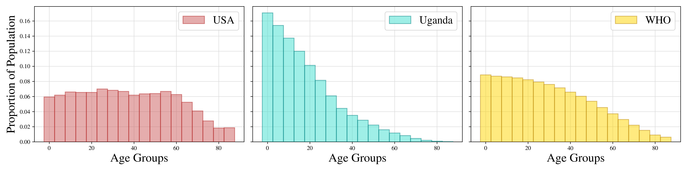

COPD affects older people more than young people. Uganda's population is much younger than the USA's, which explains the difference in crude rates. Age standardisation makes the rates comparable.
Crude Rates:
- Uganda: 5.8
- USA: 57.2
Age-Standardised Rates:
- Uganda: 28.7
- USA: 28.4

# Assumptions
1. COPD death rates are accurate and the standard of reporting of COPD deaths in the USA/Uganda is comparable.
2. UN Population Prospect for 2019 in Uganda/USA is accurate and the data used to compute these estimates is of comparable quality in both countries. Medium scenario and mid-year population seem the most sensible, without additional information.


# Workflow
1. COPD death rates data
   1. Downloaded [Notion page](https://owid.notion.site/Data-analysis-exercise-Our-World-in-Data-Junior-Data-Scientist-application-ab287a3c07264b4d91aadc436021b8c0) describing the task as HTML. 
   2. Asked ChatGPT how to parse a Table in an HTML and converted it to Pandas.
   3. Edited ChatGPT code to work for the class `notion-table-row`. Finalised `read_table_from_notion` to return numeric values.
2. Studying
   1. Googled "age standardisation". Read [this](https://ourworldindata.org/age-standardization) and doubled checked [here](https://www.statcan.gc.ca/en/dai/btd/asr) and [here](https://www.stats.indiana.edu/vitals/CalculatingARate.pdf).
   2. Read [Age Standardization of Rates: A new WHO Standard](https://cdn.who.int/media/docs/default-source/gho-documents/global-health-estimates/gpe_discussion_paper_series_paper31_2001_age_standardization_rates.pdf) to understand the need for a world standard population.
3. Copied WHO standard population values, although `read_who_std_pop` simulates production (requires Java).
4. Googled "UN World Population Prospects (2022)" and found the [Download Center](https://population.un.org/wpp/Download/Standard/CSV/) from UN's DESA. I settled for the 1950-2021 Population data on 01 July by 5-year age group for both sexes.
5. Downloaded CSV and wrote `read_UN_population_data` to compute population proportions for Uganda/USA.
6. Computed crude and age-standardized death rates for Uganda/USA.

# Formulas
```math
\begin{align}
    \text{dr}_i &= \frac{n_i}{N_i}\times 100\,000 \\
    \text{cdr}_i &= \sum_{i=1}^G \text{dr}_i \times p_i \\
    \text{asdr}_i &= \sum_{i=1}^G \text{dr}_i \times \bar{p}_i
\end{align}
```
- $G$: number of age groups
- $n_i$ number of deaths in age group $i$
- $N_i$ population in age group $i$
- $p_i$ proportion of deaths in age group $i$
- $\bar{p}_i$ proportion of the standard population in age group $i$.